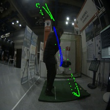

# Golf-Swing-Trajectory 프로젝트

## 개요

## 서론

## 본론

### 1. 이론적 배경

### 2. 구현 방법
1. **Main.py**  
   Golf head 인식 및 궤도 그리기
   - OpenCV를 이용한 영상 호출
   - Object_Tracking 호출
   - Filter 호출 및 tray 호출
   - Golf head가 지나간 궤적을 그리기

2. **Object_Tracking.py**  
   YOLO 모델을 이용한 Golf head 탐지 및 Bytracker를 이용한 추적
   - 미리 훈련된 가중치 다운로드 및 로드
   - YOLO fine-tuning
   - Bytracker 라이브러리를 활용한 Tracking 구현 

3. **Filter.py**  
   Particle, Kalman 필터를 사용한 영상 노이즈 제거 및 거리, 속도 측정
   - 이미지 후처리
   - 주어진 영상에서 Golf head 거리 및 속도를 예측

4. **Tray.py**  
   LSTM 모델을 이용한 궤적 예측
   - YOLO 모델을 이용한 좌표를 입력 및 훈련
   - 훈련된 모델을 이용한 궤적 예측 및 위치 추적

     

## 구현 결과

### 결과 이미지
- **정면**:
 

    

- **측면**:
 

    

## 결론
검증은 직접 촬영한 비디오는 촬영한 비디오를 사용하여 검증하였습니다. 구현결과에서 볼 수 있듯이 손과 골프채의 헤드 부분이 탐지되어 일정한 궤도를 출력하였습니다. 하지만 실시간 영상에서 품질 저하와 환경변수로 인해 오검출이 발생하였으며, 일부 노이즈가 제거되지 않아 오검출 확률이 높아지는 것을 확인하였습니다. 추가적으로전처리 과정과 필터링을 개선하는 것이 필요하다는 점을 인식했습니다. 또한, 탐지를 위한 추가적인 데이터의 필요성이 나타났습니다. 이번 과제를 통해 저희는 객체 탐지, 추적 예측 모델, 후처리를 위한 필터 제작 코드를 구현하였으며, 이를 기반으로 ML/AI 영상 기반 소프트웨어를 개발하였습니다.

## 참고문헌
1. 이상웅. "허프변환과 YOLO 기반의 골프공 궤적 추적." 한국차세대컴퓨팅학회 논문지 17.2 (2021): 42-52.
2. 이홍로, and 황치정. "화소 및 이동 정보를 이용한 골프 스윙 궤도 추적 알고리즘." 정보처리학회논문지 B 12.5 (2005): 561-566.
